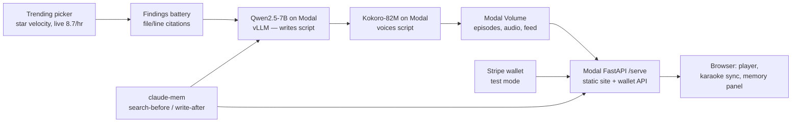

# Repo Radio

A daily AI-generated podcast that reads the source code of GitHub's fastest-trending repos and calls **HYPE / REAL / MIXED** — with a Stripe credit wallet where $1 buys 10 on-air questions, and a host that remembers every codebase it has ever covered.

**Live:** https://nithin-alaska--repo-radio-serve-fastapi-app.modal.run

The problem: a new "revolutionary" dev tool trends on GitHub every day. Everyone stars it; nobody reads the code. READMEs are marketing — the code is the truth. Repo Radio picks the fastest-rising repo by star velocity, has an LLM interrogate the actual source with file/line citations, and writes/voices a two-minute segment with a verdict. **Signature interaction:** as the host speaks, the cited files slide on screen and highlight at the exact lines, karaoke-style — every claim traces to real code.

Live now: **ep-001 — "Fuxi: The Ghost in the Shell?"** (repo [`fuxicodex/Fuxi`](https://github.com/fuxicodex/Fuxi), verdict **HYPE**). The repo claims a Go AI coding agent but ships zero Go files, and its benchmark directory's scripts hardcode a folder literally named `Fuxi-github-promo`.

## Architecture



Pipeline in words: **trending picker** (star velocity, live-measured 8.7/hr) → **findings battery** with file/line citations → **Qwen2.5-7B via vLLM on Modal** writes the script (guided decoding was cut for a broken `outlines` dependency; prompt-enforced JSON + validate/retry instead) → **Kokoro-82M on Modal** voices it (timeline = cumulative durations + 0.35s gaps between segments, which drives karaoke sync) → published to a **Modal Volume**, served by a **Modal FastAPI app** (static site + wallet API together).

## Sponsor map

| Sponsor | Role | Status |
|---|---|---|
| **Greptile** | Indexed the whole watchlist via `/v2/repositories` (live). Was to fact-check README claims against source via `/v2/query` with a 5-query battery + power call-in answers. | Indexing live; `/v2/query` currently 404s (legacy endpoint) — see honest notes below. |
| **Modal** | Hosts everything: Qwen2.5-7B (vLLM) writes scripts, Kokoro-82M voices them, and a FastAPI app serves the API + static site + audio + RSS from a Modal Volume. | Live — this is the whole deployment. |
| **Stripe** | Wallet: Checkout top-ups (test mode) → webhook credits balance → atomic per-question debit. Tiers: $1→10cr, $5→55cr, $10→120cr. | Being wired by a second session — described here, not yet claimed as tested. |
| **claude-mem** | Longitudinal host memory. Search-before-script builds a `memory_digest` fed into the Qwen prompt; write-after appends observations to `memory.json`, served to the UI's Host's Memory panel. | Worker on `localhost:37777`. |

## Quickstart

```bash
make smoke          # validates fixtures/, checks imports, confirms web/ serves — run before every push
make bake-episode REPO=owner/name   # full pipeline: repo in -> published episode out
make publish         # modal deploy modal_apps/script.py, tts.py, serve.py; prints URLs for ENDPOINTS.md/.env
```

`USE_MOCKS=1` (default, in `.env`) runs every milestone against `fixtures/` — no live API calls, no cost, deterministic. Flip to `0` per-integration in `.env` once a real key/endpoint is wired and verified; `.env.example` documents every var (`GREPTILE_API_KEY`, `GITHUB_TOKEN`, `STRIPE_SECRET_KEY`, `STRIPE_WEBHOOK_SECRET`, `MODAL_SCRIPT_URL`/`MODAL_TTS_URL`/`MODAL_SERVE_URL`, `MODAL_VOLUME`, `CLAUDE_MEM_URL`, `SITE_URL`).

## Honest notes

- **Greptile:** the `/v2/repositories` indexing API is live and indexed the full watchlist. Their legacy `/v2/query` endpoint currently returns 404, so ep-001's five findings (the "reasoning engine is a phone call"-style claims, the missing Go files, the hardcoded `Fuxi-github-promo` path) were produced by direct source analysis with verified file/line citations, in the same shape the query battery would have returned, while the query integration awaits a fixed endpoint on Greptile's side.
- **AWS:** an S3/CloudFront distribution path exists in code behind an env flag (credits were pending approval for the event), but it is **not deployed**. Modal serves everything today — models, API, and static site, from one platform.
